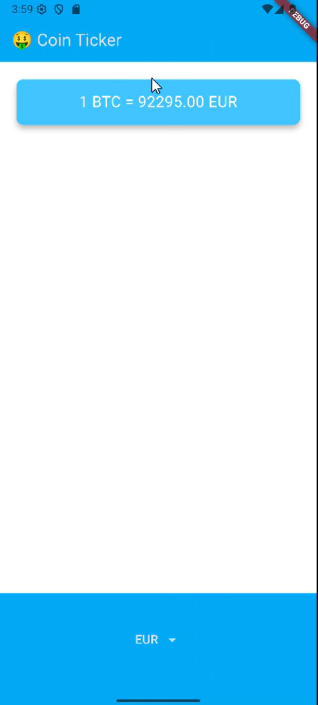
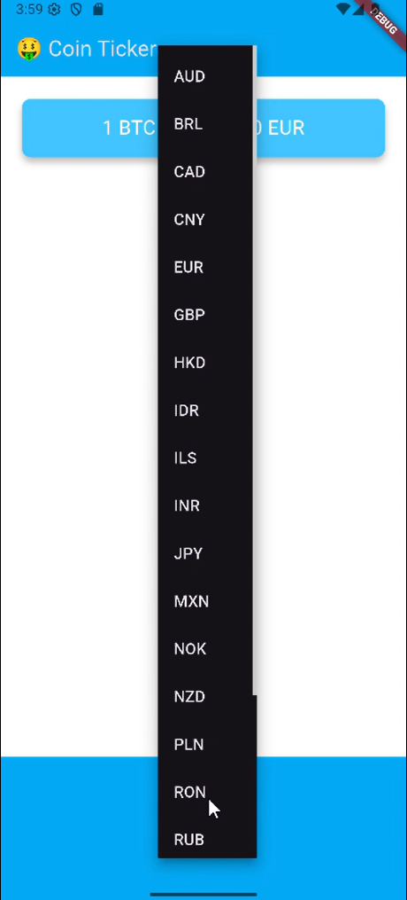

# 🪙 Coin Ticker – Conversor de Criptomonedas

Coin Ticker es una aplicación móvil desarrollada con Flutter que permite consultar el valor de **1 Bitcoin (BTC)** en diferentes monedas del mundo en tiempo real, utilizando datos obtenidos desde la API pública de **CoinGecko**.

---

## 📌 Descripción general

Esta app tiene como objetivo proporcionar una forma simple e intuitiva de visualizar el valor actual de Bitcoin en más de 20 monedas distintas, a través de una interfaz moderna que se adapta tanto a **iOS como Android**. 

---
## 👁 Vista App
<p align="center">
  
  
</p>

---

## ✨ Funcionalidades principales

- 🔄 Consulta del precio actual de 1 BTC en monedas como USD, EUR, COP, MXN, etc.
- 📱 Selector de moneda adaptado según el sistema operativo:
    - `Dropdown` para Android.
    - `CupertinoPicker` para iOS.
- 🌐 Consumo de API RESTful (CoinGecko).
- 🔵 Interfaz atractiva y moderna basada en Material Design.

---

## ✅ Requisitos del proyecto

- **Flutter SDK** (versión 3.x o superior recomendada)
- **Dart SDK** (v2.17 o superior)
- Emulador o dispositivo real (iOS o Android)
- Conexión a Internet para realizar la consulta a la API

---

## 🧰 Tecnologías y paquetes utilizados

| Herramienta / Paquete     | Propósito                                           |
|--------------------------|----------------------------------------------------|
| `Flutter`                | Framework para desarrollo de apps móviles          |
| `http`                   | Realizar peticiones a la API REST                  |
| `cupertino` (Flutter SDK)| Widgets estilo iOS para interfaz adaptativa        |
| `dart:convert`           | Conversión de datos JSON a objetos Dart            |

---

## 📁 Estructura del proyecto

```
/lib
├── coin_data.dart         # Archivo que se conecta con la API CoinGecko
├── main.dart              # Punto de entrada de la aplicación Flutter
└── price_screen.dart      # Pantalla principal que muestra el precio de BTC

/pubspec.yaml              # Archivo de configuración del proyecto
```
---

## 👤 Autor

Desarrollado por **[María José Mendieta Ortiz]**   
🌐 [https://github.com/MariaJoseMendieta]